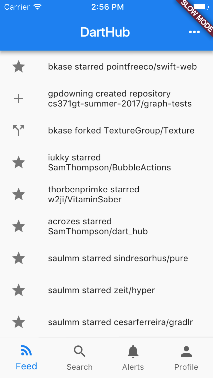
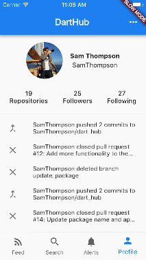
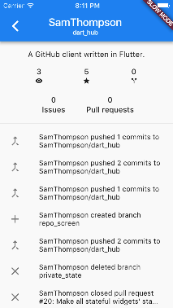

# dart_hub

A GitHub client written in flutter. The goal of this project is to build something non-trivial in Flutter to flex the framework's muscles.

## Building

In order to build this project, you'll need to add a `keys.dart` file to the `lib/` directory of this project.
This file contains the oauth client id and client secret necessary to communicate with the GitHub apis.
Inside the file you'll need to define two constants:
```dart
const String CLIENT_ID = 'your oauth client id';
const String CLIENT_SECRET = 'your oauth client secret';
```
You can create an oauth api project [here](https://github.com/settings/applications/new).


## Screenshots

### Feed
 

### Profile
   

### Repo


## TODO

- [x] Activity feed showing recent activity
- [x] Notifications ui which shows unread notifications
- [x] Profile ui that shows current logged in user
- [x] Implement pagination on list screens
- [x] Implement follower listing view
- [x] Implement following listing view
- [x] Move notifications in between search and profile
- [x] Implement repo listing view
- [x] Implement showing user activity on profile
- [x] Repository screen
- [ ] Event items clickable
- [ ] Notif items clickable
- [ ] Add ui for filter parameters on notifs, repos, etc
- [ ] Implement search view
- [ ] File viewer
- [ ] Support more event types


## Contributing

This project is moving pretty fast and I'm doing a lot of development on master. Ideas and feedback are always welcome, feel free to open an issue to discuss 😄
