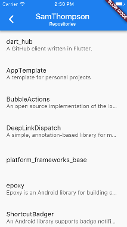
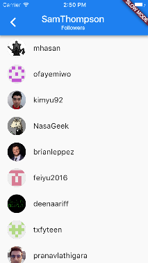
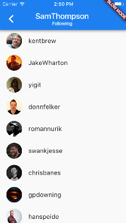

# dart_hub

A GitHub client written in flutter.

## Screenshots

   

## TODO

- [x] Activity feed showing recent activity
- [x] Notifications ui which shows unread notifications
- [x] Profile ui that shows current logged in user
- [x] Implement pagination on list screens
- [x] Implement follower listing view
- [x] Implement following listing view
- [x] Move notifications in between search and profile
- [x] Implement repo listing view
- [x] Implement showing user activity on profile
- [ ] Activity items clickable
- [ ] Notification items clickable
- [ ] Support comments in activity feed
- [ ] Repository screen
- [ ] Finish up supporting different parameters for notifications
- [ ] Implement search view
- [ ] File viewer
